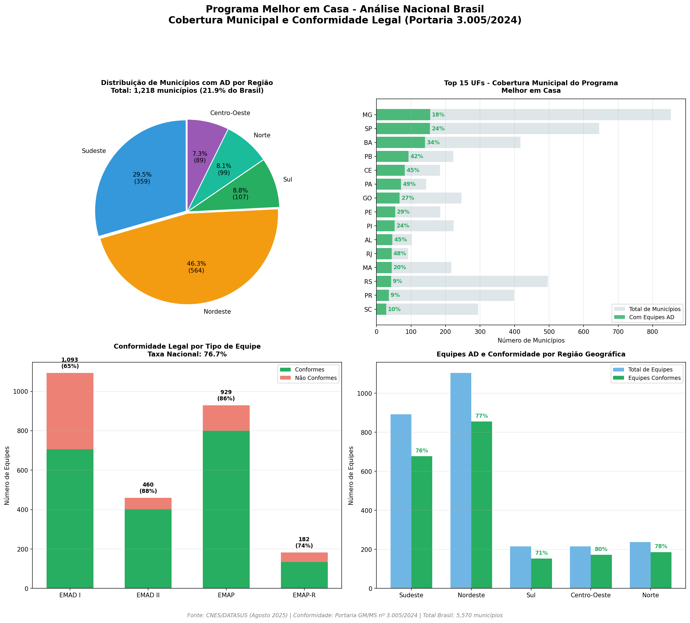
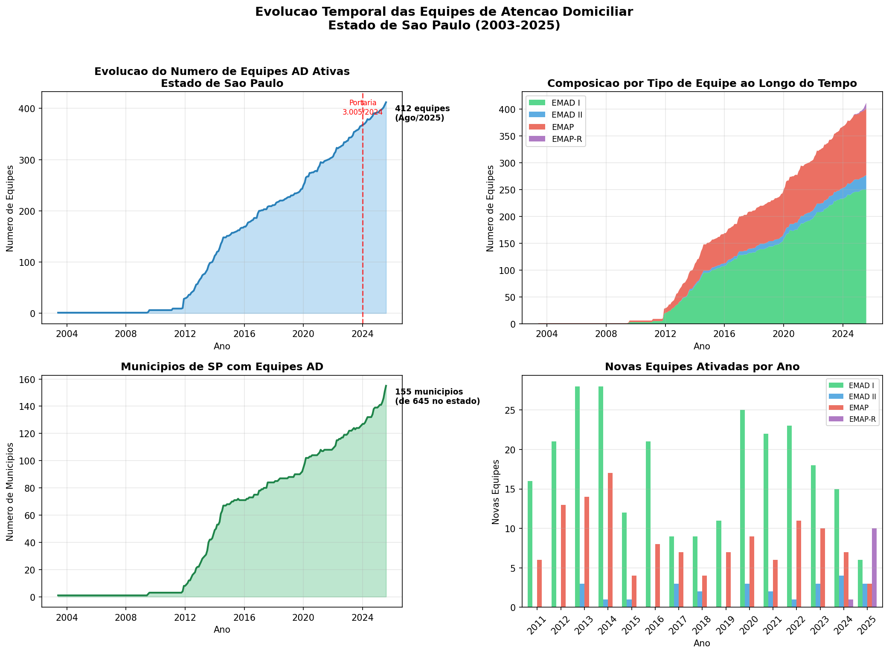

# PARTE 4 - Cobertura Municipal e Conformidade Legal das Equipes AD

## Resumo

Analisa a **cobertura municipal** do Programa Melhor em Casa e verifica se as equipes EMAD/EMAP estão em **conformidade com a Portaria GM/MS nº 3.005/2024**.

---

## 🇧🇷 Resultados Nacionais (Agosto 2025)

### Cobertura Municipal do Programa

| Indicador | Valor |
|-----------|-------|
| Municípios com equipes AD | **1.218** de 5.570 |
| Cobertura Nacional | **21.9%** |
| Total de equipes ativas | **2.664** |

#### Cobertura por Região

| Região | Municípios c/ AD | Total Municípios | Cobertura |
|--------|------------------|------------------|-----------|
| Nordeste | 564 | 1.794 | **31.4%** |
| Norte | 99 | 450 | **22.0%** |
| Sudeste | 359 | 1.668 | **21.5%** |
| Centro-Oeste | 89 | 467 | **19.1%** |
| Sul | 107 | 1.191 | **9.0%** |

### Conformidade Legal Nacional - 2.664 equipes

| Tipo | Total | Conformes | Não-Conformes | Taxa |
|:----:|:-----:|:---------:|:-------------:|:----:|
| EMAD I | 1.093 | 706 | 387 | **64.6%** |
| EMAD II | 460 | 403 | 57 | **87.6%** |
| EMAP | 929 | 800 | 129 | **86.1%** |
| EMAP-R | 182 | 134 | 48 | **73.6%** |
| **TOTAL** | **2.664** | **2.043** | **621** | **76.7%** |

> **76.7% das equipes AD do Brasil estão em conformidade** com a Portaria 3.005/2024.

#### Conformidade por Região

| Região | Equipes | Conformes | Taxa |
|--------|---------|-----------|------|
| Centro-Oeste | 216 | 172 | **79.6%** |
| Norte | 237 | 186 | **78.5%** |
| Nordeste | 1.104 | 855 | **77.4%** |
| Sudeste | 892 | 677 | **75.9%** |
| Sul | 215 | 153 | **71.2%** |



---

## 🏛️ Resultados Estado de São Paulo (Agosto 2025)

### Estado de São Paulo - 412 equipes AD ativas

| Tipo | Total | Conformes | Não-Conformes | Taxa |
|:----:|:-----:|:---------:|:-------------:|:----:|
| EMAD I | 251 | 150 | 101 | **59.8%** |
| EMAD II | 26 | 20 | 6 | **76.9%** |
| EMAP | 124 | 113 | 11 | **91.1%** |
| EMAP-R | 11 | 9 | 2 | **81.8%** |
| **TOTAL** | **412** | **292** | **120** | **70.9%** |

> **70.9% das equipes de SP estão em conformidade** com a nova legislação.

### Por que algumas equipes não estão conformes?

A **Portaria 3.005/2024** (janeiro de 2024) **aumentou** o requisito de enfermeiro:
- **Antes**: 40h (Portaria 825/2016)
- **Agora**: 60h (Portaria 3.005/2024)

As equipes não-conformes têm exatamente **40h de enfermeiro** - estavam conformes com a lei antiga.

---

## Arquivos

### Análise Nacional (Brasil)

| Arquivo | Descrição |
|---------|-----------|
| `analise_nacional_brasil.py` | **Script principal** - Cobertura + Conformidade Nacional |
| `analise_nacional_brasil.png` | Dashboard com 4 gráficos |
| `conformidade_legal_brasil.csv` | Resultado detalhado por equipe (2.664 registros) |
| `cobertura_municipal_brasil.csv` | Cobertura municipal por UF (27 registros) |
| `resumo_por_regiao_brasil.csv` | Resumo de conformidade por região |

### Análise Estado de São Paulo

| Arquivo | Descrição |
|---------|-----------|
| `analise_conformidade_sp_estado.py` | Análise de conformidade Estado SP (412 equipes) |
| `visualizacao_temporal.py` | Visualização da evolução temporal das equipes |
| `visualizacao_conformidade_temporal.py` | Evolução da conformidade ao longo do tempo |
| `conformidade_legal_sp_estado.csv` | Resultado detalhado por equipe |
| `evolucao_temporal_ad_sp.png` | Gráfico de evolução 2011-2025 |
| `evolucao_conformidade_temporal.png` | Gráfico de conformidade ao longo do tempo |

---

## Evolução Temporal SP (2011-2025)

O **Programa Melhor em Casa** foi instituído em **novembro de 2011** pela Portaria GM/MS nº 2.527/2011.

> **Nota**: O CNES contém 6 registros de equipes AD anteriores a 2011 (1 em 2003, 5 em 2009), provavelmente de programas precursores de atenção domiciliar que foram reclassificados. A visualização considera o período a partir de 2011.

| Ano | Equipes Ativas | Municípios |
|:---:|:--------------:|:----------:|
| 2011 | 6 | 5 |
| 2015 | 167 | 71 |
| 2020 | 277 | 104 |
| 2024 | 391 | 139 |
| 2025 | 412 | 155 |

**Crescimento 2020-2025: 64.8%**



---

## Como rodar

```bash
cd "Outputs&Codigo/PARTE4"
source ../../venv/bin/activate

# Análise Nacional (Brasil inteiro)
python analise_nacional_brasil.py

# Análise Estado de São Paulo
python analise_conformidade_sp_estado.py

# Visualizações temporais (SP)
python visualizacao_temporal.py
python visualizacao_conformidade_temporal.py
```

---

## Códigos de Tipo de Equipe AD

| Código | Tipo | Descrição |
|:------:|:----:|:----------|
| 22 | EMAD I | Equipe Multiprofissional de Atenção Domiciliar Tipo I |
| 46 | EMAD II | Equipe Multiprofissional de Atenção Domiciliar Tipo II |
| 23 | EMAP | Equipe Multiprofissional de Apoio |
| 77 | EMAP-R | Equipe Multiprofissional de Apoio - Rural |

---

## Base Legal

**Portaria GM/MS nº 3.005, de 2 de janeiro de 2024**

### Art. 547 - Composição mínima EMAD I:
| Profissional | CHS Mínima |
|--------------|------------|
| Médico | 40h |
| **Enfermeiro** | **60h** |
| Fisioterapeuta OU Assistente Social | 30h |
| Técnico de Enfermagem | 120h |

### Art. 547, §1º:
> "Nenhum profissional componente de EMAD poderá ter carga horária inferior a **20 (vinte) horas** de trabalho."

---

*Última atualização: Janeiro 2025*
